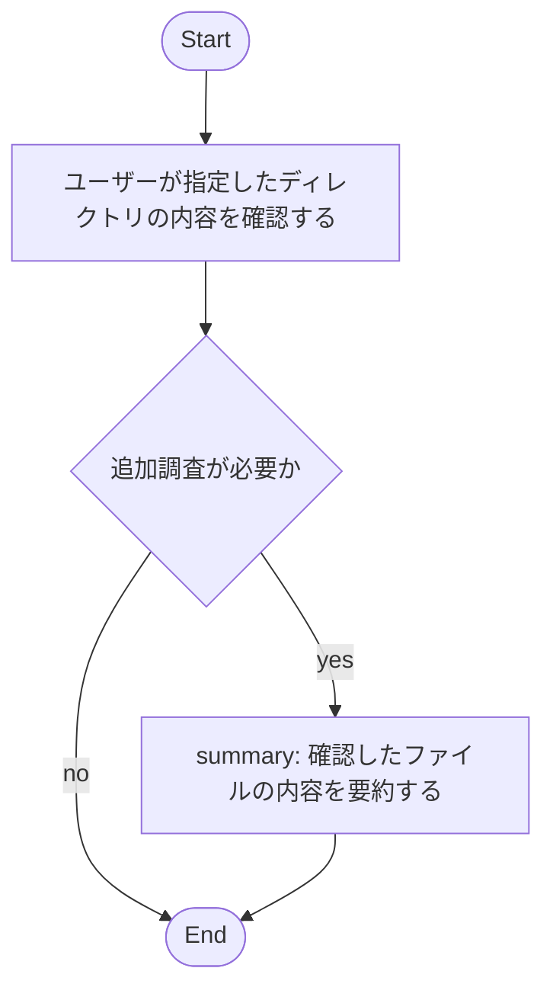

# Markdown Driven Workflow Sample

このワークフローは、ユーザーが指定した作業ディレクトリを調べ、利用可能なツールの説明に応じて処理を補正してから実行されます。

- 想定タスク: ディレクトリ配下のファイル確認と内容要約
- 期待するツール: analyze_files, get_loaded_config_info など
- 注意: mermaid block は 1 つだけ含めてください
- ユーザーがメッセージで指定したディレクトリパスをそのまま使用してください。
- 実在しないダミーパス（例: /path/to/work）は生成しないでください。
- メッセージに具体パスがない場合だけ、既定の相対パス `work` を使用してください。
- `analyze_files` に渡す入力は、Inspect で確認した実在パスだけにしてください。
- ディレクトリを分析するときは、ファイル名を推測して `/absolute/path/to/work/file1.txt` のような仮想パスを組み立ててはいけません。
- `analyze_files` には、原則としてユーザー指定ディレクトリそのもの、または Inspect で実在確認できた個別ファイルだけを渡してください。
- 既定ケースでは `work` をそのまま `analyze_files` に渡して要約してください。
- このサンプルは検証用のため、対象ディレクトリにファイルが存在する限り `追加調査が必要か` では原則 `yes` を選んで要約まで進めてください。

