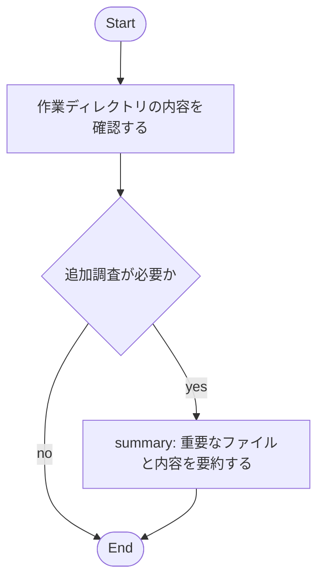

# Markdown Driven Workflow Sample

このワークフローは、ユーザーが指定した作業ディレクトリを調べ、利用可能なツールの説明に応じて処理を補正してから実行されます。

- 想定タスク: ディレクトリ配下のファイル確認と内容要約
- 期待するツール: analyze_files, get_loaded_config_info など
- 注意: mermaid block は 1 つだけ含めてください

